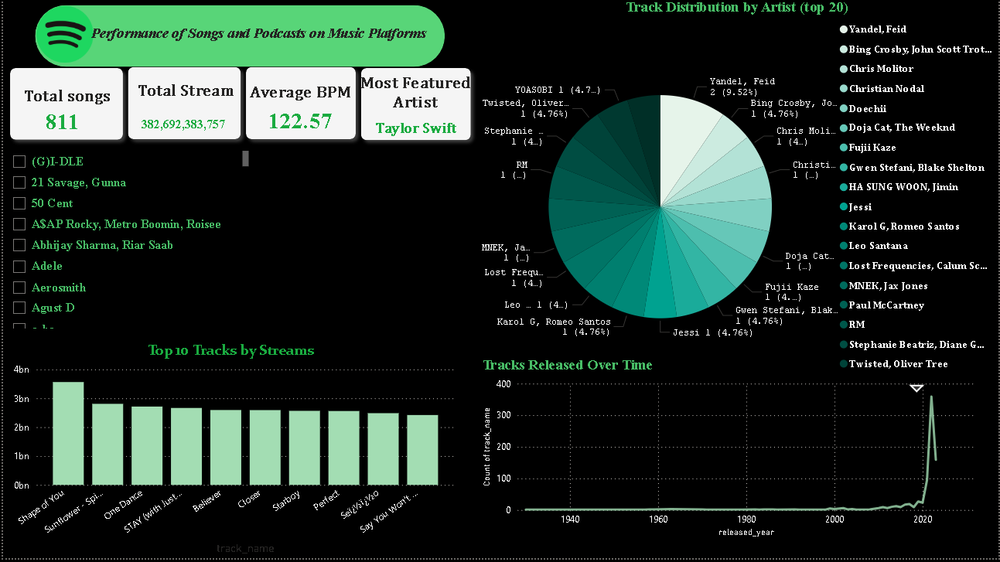

# Power-BI-Dashboard

# 🎧 Spotify Music & Podcasts Performance Dashboard

This interactive dashboard provides a comprehensive analysis of music and podcast performance on Spotify, offering deep insights into artist distribution, top tracks, and content release trends over time.

---

## ✨ Features & Analysis

* **Key Performance Indicators (KPIs):** Displays crucial metrics such as Total Songs, Total Streams, and Average BPM (Beats Per Minute).
* **Most Featured Artist:** Highlights the top artist with the most featured tracks (e.g., Taylor Swift).
* **Artist Distribution:** A detailed pie chart visualizing the distribution of tracks by various artists, indicating their proportional contribution to the dataset.
* **Top 10 Tracks by Streams:** Ranks the top 10 songs based on their total stream count, identifying popular content.
* **Release Trends Over Time:** A line chart showcasing the historical trend of tracks released, revealing significant growth periods.
* **Interactive Filters:** Allows users to filter data by specific artists or content categories for focused analysis.

---

## 📌 Data Source

The dashboard is built using a Spotify music performance dataset (e.g., `spotify_data.csv` or directly within the Power BI file).

---

## 🛠️ Tools & Technologies Used

* **Microsoft Power BI**: Used as the primary tool for building this comprehensive and interactive dashboard.
* **Data Visualization**: Leveraging Power BI's advanced charting and data summarization capabilities.

---

## 📁 Project Structure
📁 Spotify-Music-Dashboard

├── 📄 spotify_data.csv                 # Raw dataset with track-level Spotify data

├── 🖼️ spotify_dashboard_preview.png    # Screenshot of the finished dashboard

└── 📄 README.md                        # Project documentation

## 🖼️ Dashboard Preview

---

## 🙋‍♀️ About Me

I'm Mayar Hany, a passionate Business Intelligence student specializing in transforming complex datasets into clear, actionable visual insights. My goal is to build impactful dashboards that drive informed decision-making.

🔗 [LinkedIn](https://linkedin.com/in/mayar-hany-139a2a2a6) 
